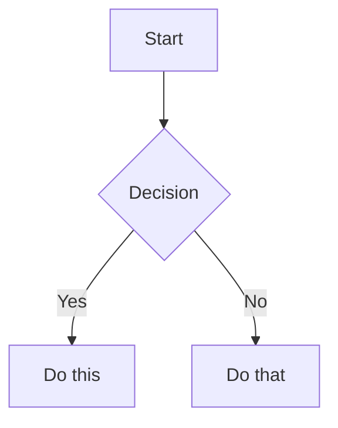

# Obsidian Flavored Markdown Reference

Obsidian extends CommonMark and GFM with wikilinks, embeds, callouts, properties, comments, and other syntax.

## Internal Links (Wikilinks)

```markdown
[[Note Name]]
[[Note Name|Display Text]]
[[Note Name#Heading]]
[[Note Name#^block-id]]
[[#Heading in same note]]
```

Define a block ID by appending `^block-id`:

```markdown
This paragraph can be linked to. ^my-block-id
```

## Embeds

```markdown
![[Note Name]]
![[Note Name#Heading]]
![[image.png]]
![[image.png|300]]
![[document.pdf#page=3]]
```

## Callouts

```markdown
> [!note]
> Basic callout.

> [!warning] Custom Title
> Callout with custom title.

> [!faq]- Collapsed by default
> Foldable callout.
```

Common types: `note`, `tip`, `warning`, `info`, `example`, `quote`, `bug`, `danger`, `success`, `failure`, `question`, `abstract`, `todo`.

## Properties (Frontmatter)

```yaml
---
title: My Note
date: 2024-01-15
tags:
  - project
  - active
aliases:
  - Alternative Name
status: in-progress
priority: high
cssclasses:
  - custom-class
---
```

### Property Types

| Type | Example |
|------|---------|
| Text | `title: My Title` |
| Number | `rating: 4.5` |
| Checkbox | `completed: true` |
| Date | `date: 2024-01-15` |
| Date & Time | `due: 2024-01-15T14:30:00` |
| List | `tags: [one, two]` or YAML list |
| Links | `related: "[[Other Note]]"` |

### Default Properties

- `tags` — searchable, shown in graph view
- `aliases` — alternative names for link suggestions
- `cssclasses` — CSS classes for reading/editing view

## Tags

```markdown
#tag
#nested/tag
#tag-with-dashes
#tag_with_underscores
```

Tags can contain: letters (any language), numbers (not first character), underscores `_`, hyphens `-`, forward slashes `/` (for nesting).

## Comments

```markdown
This is visible %%but this is hidden%% text.

%%
This block is hidden in reading view.
%%
```

## Highlighting

```markdown
==Highlighted text==
```

## Math (LaTeX)

```markdown
Inline: $e^{i\pi} + 1 = 0$

$$
\frac{a}{b} = c
$$
```

## Diagrams (Mermaid)

````markdown

````

## Footnotes

```markdown
Text with a footnote[^1].

[^1]: Footnote content.

Inline footnote.^[This is inline.]
```

## Embeds — Extended

### Images

```markdown
![[image.png]]
![[image.png|640x480]]
![[image.png|300]]


```

### Audio & PDF

```markdown
![[audio.mp3]]
![[document.pdf]]
![[document.pdf#page=3]]
![[document.pdf#height=400]]
```

### Search Results

````markdown
```query
tag:#project status:done
```
````

## Callouts — Full Type List

| Type | Aliases | Color |
|------|---------|-------|
| `note` | — | Blue |
| `abstract` | `summary`, `tldr` | Teal |
| `info` | — | Blue |
| `todo` | — | Blue |
| `tip` | `hint`, `important` | Cyan |
| `success` | `check`, `done` | Green |
| `question` | `help`, `faq` | Yellow |
| `warning` | `caution`, `attention` | Orange |
| `failure` | `fail`, `missing` | Red |
| `danger` | `error` | Red |
| `bug` | — | Red |
| `example` | — | Purple |
| `quote` | `cite` | Gray |

### Nested & Foldable

```markdown
> [!faq]- Collapsed by default
> Hidden until expanded.

> [!faq]+ Expanded by default
> Visible but collapsible.

> [!question] Outer
> > [!note] Inner
> > Nested content.
```
